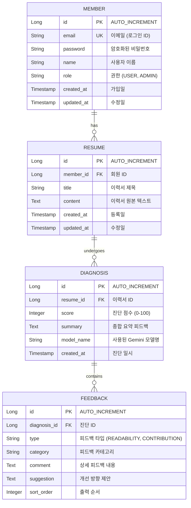

# 데이터베이스 설계 및 ERD (Database Specification)

> **프로젝트**: JDSnack — AI 이력서 진단 서비스  
> **버전**: 1.0  
> **작성일**: 2026-05-21  

현재 1차 MVP 아키텍처는 별도의 백엔드 데이터베이스를 연동하지 않고 브라우저의 `LocalStorage`를 활용해 데이터를 임시 저장하는 무상태(Stateless) 아키텍처입니다. 

하지만 상용 서비스로의 확장(예: 회원가입, 과거 진단 히스토리 관리, 다중 이력서 관리 등)을 고려하여 **데이터베이스 연동 시 사용될 표준 ERD 및 스키마 설계**를 작성하였습니다. 향후 DB 도입 단계에서 이 설계를 그대로 반영하여 개발을 진행할 수 있습니다.

---

## 1. ERD (Entity Relationship Diagram)

아래 다이어그램은 회원(Member), 이력서(Resume), 진단 기록(Diagnosis), 그리고 상세 피드백(Feedback) 간의 관계를 보여줍니다.



---

## 2. 상세 테이블 정의서

### 2.1 `members` (회원 테이블)

서비스를 이용하는 회원 정보를 관리합니다.

| 컬럼명 | 데이터 타입 | 제약 조건 | 설명 |
| :--- | :--- | :--- | :--- |
| `id` | `BIGINT` | PK, AUTO_INCREMENT | 고유 식별자 |
| `email` | `VARCHAR(100)` | UNIQUE, NOT NULL | 이메일 주소 (로그인 ID) |
| `password` | `VARCHAR(255)` | NOT NULL | 해시 처리된 비밀번호 |
| `name` | `VARCHAR(50)` | NOT NULL | 회원 이름 |
| `role` | `VARCHAR(20)` | NOT NULL, DEFAULT 'USER' | 시스템 권한 (`USER`, `ADMIN`) |
| `created_at` | `TIMESTAMP` | NOT NULL, DEFAULT CURRENT_TIMESTAMP | 가입 일시 |
| `updated_at` | `TIMESTAMP` | NOT NULL, DEFAULT CURRENT_TIMESTAMP ON UPDATE CURRENT_TIMESTAMP | 정보 수정 일시 |

### 2.2 `resumes` (이력서 테이블)

회원이 작성하거나 업로드한 이력서 텍스트 정보를 저장합니다.

| 컬럼명 | 데이터 타입 | 제약 조건 | 설명 |
| :--- | :--- | :--- | :--- |
| `id` | `BIGINT` | PK, AUTO_INCREMENT | 고유 식별자 |
| `member_id` | `BIGINT` | FK (members.id), NULLABLE | 이력서 소유 회원 ID (비회원 진단 시 NULL 허용 가능) |
| `title` | `VARCHAR(100)` | NOT NULL | 이력서 제목 |
| `content` | `TEXT` | NOT NULL | 이력서 원본 텍스트 데이터 (최대 10,000자) |
| `created_at` | `TIMESTAMP` | NOT NULL, DEFAULT CURRENT_TIMESTAMP | 등록 일시 |
| `updated_at` | `TIMESTAMP` | NOT NULL, DEFAULT CURRENT_TIMESTAMP ON UPDATE CURRENT_TIMESTAMP | 수정 일시 |

### 2.3 `diagnoses` (진단 기록 테이블)

이력서에 대해 수행된 AI 진단 요청의 총점 및 요약 코멘트를 관리합니다.

| 컬럼명 | 데이터 타입 | 제약 조건 | 설명 |
| :--- | :--- | :--- | :--- |
| `id` | `BIGINT` | PK, AUTO_INCREMENT | 고유 식별자 |
| `resume_id` | `BIGINT` | FK (resumes.id), ON DELETE CASCADE | 진단 대상 이력서 ID |
| `score` | `INT` | NOT NULL, CHECK (score BETWEEN 0 AND 100) | AI가 부여한 종합 점수 |
| `summary` | `TEXT` | NOT NULL | AI가 작성한 종합 평 및 요약 코멘트 |
| `model_name` | `VARCHAR(50)` | NOT NULL | 진단에 사용된 Gemini 모델 버전 (예: `gemini-2.0-flash`) |
| `created_at` | `TIMESTAMP` | NOT NULL, DEFAULT CURRENT_TIMESTAMP | 진단 수행 일시 |

### 2.4 `feedbacks` (상세 피드백 테이블)

진단 내역의 세부 피드백 항목(가독성 개선 제안 및 프로젝트 기여도 구체화 제안)을 구조적으로 저장합니다.

| 컬럼명 | 데이터 타입 | 제약 조건 | 설명 |
| :--- | :--- | :--- | :--- |
| `id` | `BIGINT` | PK, AUTO_INCREMENT | 고유 식별자 |
| `diagnosis_id` | `BIGINT` | FK (diagnoses.id), ON DELETE CASCADE | 소속 진단 기록 ID |
| `type` | `VARCHAR(30)` | NOT NULL | 피드백 대분류 (`READABILITY`, `CONTRIBUTION`) |
| `category` | `VARCHAR(50)` | NOT NULL | 피드백 소분류 (예: '문장 구조', '성과 수치화') |
| `comment` | `TEXT` | NOT NULL | AI 진단 소견 및 이유 설명 |
| `suggestion` | `TEXT` | NOT NULL | 개선안 구체적 제안 및 예시 |
| `sort_order` | `INT` | NOT NULL | 화면 렌더링 정렬 순서 |

---

## 3. DDL (Data Definition Language) - MySQL 기준

```sql
-- 1. 회원 테이블 생성
CREATE TABLE members (
    id BIGINT AUTO_INCREMENT PRIMARY KEY,
    email VARCHAR(100) NOT NULL UNIQUE,
    password VARCHAR(255) NOT NULL,
    name VARCHAR(50) NOT NULL,
    role VARCHAR(20) NOT NULL DEFAULT 'USER',
    created_at TIMESTAMP NOT NULL DEFAULT CURRENT_TIMESTAMP,
    updated_at TIMESTAMP NOT NULL DEFAULT CURRENT_TIMESTAMP ON UPDATE CURRENT_TIMESTAMP
) ENGINE=InnoDB DEFAULT CHARSET=utf8mb4 COLLATE=utf8mb4_unicode_ci;

-- 2. 이력서 테이블 생성
CREATE TABLE resumes (
    id BIGINT AUTO_INCREMENT PRIMARY KEY,
    member_id BIGINT NULL,
    title VARCHAR(100) NOT NULL,
    content TEXT NOT NULL,
    created_at TIMESTAMP NOT NULL DEFAULT CURRENT_TIMESTAMP,
    updated_at TIMESTAMP NOT NULL DEFAULT CURRENT_TIMESTAMP ON UPDATE CURRENT_TIMESTAMP,
    CONSTRAINT fk_resumes_member FOREIGN KEY (member_id) REFERENCES members(id) ON DELETE SET NULL
) ENGINE=InnoDB DEFAULT CHARSET=utf8mb4 COLLATE=utf8mb4_unicode_ci;

-- 3. 진단 기록 테이블 생성
CREATE TABLE diagnoses (
    id BIGINT AUTO_INCREMENT PRIMARY KEY,
    resume_id BIGINT NOT NULL,
    score INT NOT NULL,
    summary TEXT NOT NULL,
    model_name VARCHAR(50) NOT NULL,
    created_at TIMESTAMP NOT NULL DEFAULT CURRENT_TIMESTAMP,
    CONSTRAINT fk_diagnoses_resume FOREIGN KEY (resume_id) REFERENCES resumes(id) ON DELETE CASCADE,
    CONSTRAINT chk_diagnoses_score CHECK (score BETWEEN 0 AND 100)
) ENGINE=InnoDB DEFAULT CHARSET=utf8mb4 COLLATE=utf8mb4_unicode_ci;

-- 4. 상세 피드백 테이블 생성
CREATE TABLE feedbacks (
    id BIGINT AUTO_INCREMENT PRIMARY KEY,
    diagnosis_id BIGINT NOT NULL,
    type VARCHAR(30) NOT NULL,
    category VARCHAR(50) NOT NULL,
    comment TEXT NOT NULL,
    suggestion TEXT NOT NULL,
    sort_order INT NOT NULL,
    CONSTRAINT fk_feedbacks_diagnosis FOREIGN KEY (diagnosis_id) REFERENCES diagnoses(id) ON DELETE CASCADE
) ENGINE=InnoDB DEFAULT CHARSET=utf8mb4 COLLATE=utf8mb4_unicode_ci;

-- 5. 성능 최적화를 위한 인덱스 생성
CREATE INDEX idx_resumes_member ON resumes(member_id);
CREATE INDEX idx_diagnoses_resume ON diagnoses(resume_id);
CREATE INDEX idx_feedbacks_diagnosis ON feedbacks(diagnosis_id);
```

---

## 4. 확장 로드맵 및 DB 연동 시 변경점

데이터베이스를 연동하게 되는 시점(예: 2차 스프린트)에는 다음과 같은 아키텍처 및 코드 변경이 이루어집니다.

1. **의존성 추가**: 백엔드 `build.gradle`에 Spring Data JPA 및 DB 커넥터(예: `mysql-connector-j` 혹은 `h2` 등) 의존성을 추가합니다.
2. **JPA Entity 정의**: 위의 테이블 스키마에 맞춘 `@Entity` 클래스들(`Member`, `Resume`, `Diagnosis`, `Feedback`)을 작성합니다.
3. **Repository 레이어 구축**: Spring Data JPA의 `JpaRepository`를 구현하여 DB C.R.U.D 인터페이스를 확보합니다.
4. **Service 레이어 변경**: 2차 MVP에서 실제 분석 결과가 생기면, 응답 DTO만 반환하던 구조에서 데이터를 Entity로 빌드하여 `repository.save()`를 호출하는 로직이 추가됩니다.
5. **프론트엔드 API 연동**:
   - 로그인 / 회원가입 API 추가 연동
   - 과거 진단 내역 리스트 조회 API (`GET /api/diagnoses`)
   - 특정 진단 상세 조회 API (`GET /api/diagnoses/{id}`)
