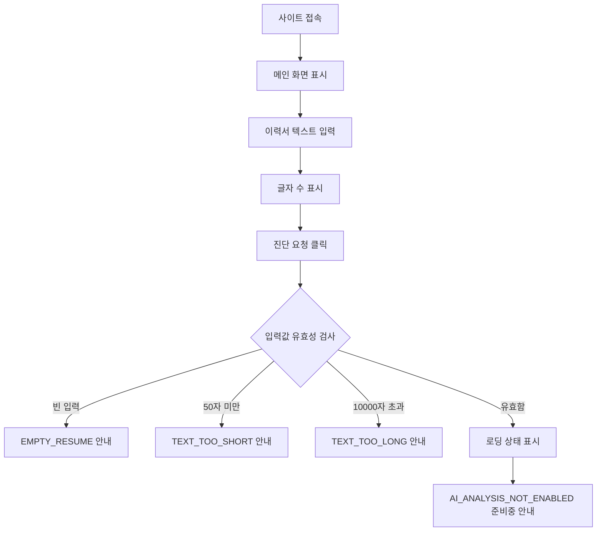

# UI 명세서

> 프로젝트: JDSnack — 1차 MVP 서비스 뼈대  
> 기준 결정: 사용자 인증 정보 입력과 외부 AI 연동 UI는 1차 MVP에서 제공하지 않는다.

## 1. UI 목표

1차 MVP의 화면 목표는 실제 AI 분석이 아니라, 사용자가 이력서를 입력하고 검증 결과 또는 준비중 안내를 이해하는 흐름을 완성하는 것이다.

## 2. 화면 구성

### 2.1 헤더

- 서비스명: `JDSnack`
- 보조 문구: `이력서 분석 기능 준비 중`
- 인증 정보 설정 버튼은 제공하지 않는다.

### 2.2 입력 영역

- 이력서 텍스트를 붙여넣는 `textarea`
- 글자 수 카운터
- 최소 기준: 50자
- 최대 기준: 10,000자
- 입력 내용은 사용자 편의를 위해 LocalStorage에 자동 저장할 수 있다.
- LocalStorage에는 이력서 입력값만 저장하고, 인증 정보는 저장하지 않는다.

### 2.3 진단 버튼

- 버튼 문구: `진단 요청`
- 빈 입력이면 클릭 시 인라인 오류를 표시한다.
- 50자 미만이면 최소 길이 안내를 표시한다.
- 10,000자 초과이면 최대 길이 안내를 표시한다.
- 유효한 입력이면 로딩 상태를 잠깐 표시한 뒤 준비중 안내를 보여준다.

### 2.4 결과 영역

1차 MVP 결과 영역은 실제 점수/피드백 대신 준비중 안내 카드를 표시한다.

```text
AI 분석 기능은 준비 중입니다.
현재는 이력서 입력 검증만 가능합니다.
```

상태는 아래 네 가지로 구분한다.

| 상태 | 표시 내용 |
|---|---|
| `idle` | 이력서를 입력하고 진단 요청을 할 수 있음을 안내 |
| `loading` | 요청 처리 중 표시 |
| `not-enabled` | `AI_ANALYSIS_NOT_ENABLED` 준비중 안내 |
| `error` | 입력 검증 또는 네트워크 오류 안내 |

`501 AI_ANALYSIS_NOT_ENABLED`는 장애 실패가 아니라 1차 MVP의 정상 준비중 상태로 보고 `not-enabled`로 렌더링한다.

## 3. 사용자 흐름



## 4. 오류 메시지

| 상황 | 메시지 |
|---|---|
| 빈 입력 | `이력서 내용을 입력해주세요.` |
| 50자 미만 | `이력서 내용이 너무 짧습니다. 최소 50자 이상 입력해주세요.` |
| 10,000자 초과 | `이력서 내용이 너무 깁니다. 10,000자 이내로 입력해주세요.` |
| AI 미연동 | `AI 분석 기능은 준비 중입니다. 현재는 이력서 입력 검증만 가능합니다.` |
| 네트워크 오류 | `네트워크 연결을 확인해주세요.` |

## 5. 컴포넌트 구조

```text
src/
├── components/
│   ├── ResumeInput.tsx
│   ├── DiagnoseButton.tsx
│   ├── ResultPanel.tsx
│   └── StatusMessage.tsx
├── hooks/
│   └── useDiagnose.ts
├── services/
│   └── api.ts
└── types/
    └── diagnosis.ts
```

## 6. 프론트 타입

```ts
type AnalysisStatus = 'idle' | 'loading' | 'not-enabled' | 'error';

interface DiagnoseRequest {
  resumeText: string;
}

interface ApiError {
  code: 'EMPTY_RESUME' | 'TEXT_TOO_SHORT' | 'TEXT_TOO_LONG' | 'AI_ANALYSIS_NOT_ENABLED' | 'INTERNAL_ERROR';
  message: string;
}

interface ApiResponse<T> {
  success: boolean;
  data: T | null;
  error: ApiError | null;
  timestamp: string;
}
```

## 7. 접근성 기준

- 입력 오류는 `aria-describedby`로 textarea와 연결한다.
- 로딩 상태는 `aria-live="polite"` 영역에 표시한다.
- 준비중 안내는 버튼 클릭 후 키보드 사용자도 인지할 수 있게 결과 영역에 포커스 이동을 허용한다.

## 8. 2차 MVP 확장 예정

- 서버 기반 AI 분석 결과 렌더링
- 점수 게이지
- 가독성 피드백 목록
- 프로젝트 기여도 피드백 목록
- 종합 요약 카드
