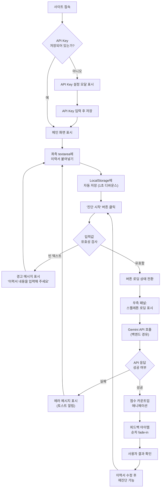
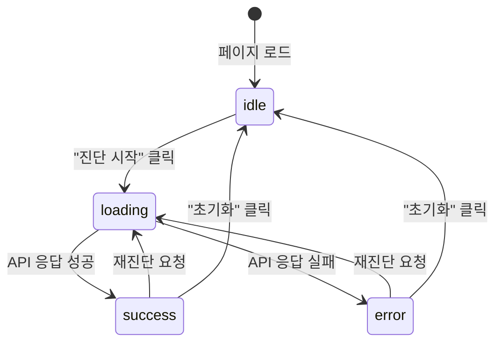

# UI/UX 상세 설계 문서 (UI/UX Specification)

> **프로젝트**: JDSnack — AI 이력서 진단 서비스  
> **작성일**: 2026-05-21  
> **마감일**: 2026-05-26 (월)  
> **기술 스택**: Vite + React (TypeScript) + Vanilla CSS  
> **디자인 컨셉**: 애플 스타일의 깔끔하고 모던한 미니멀 화이트/그레이 레이아웃

---

## 1. 디자인 시스템

### 1-1. 컬러 팔레트

| 용도 | 색상 코드 | 설명 |
|------|----------|------|
| 배경 | `#FAFAFA` | 페이지 전체 배경, 부드러운 오프화이트 |
| 카드 배경 | `#FFFFFF` | 카드·모달·입력창 내부 배경 |
| 텍스트 기본 | `#1D1D1F` | 제목, 본문 등 주요 텍스트 |
| 텍스트 보조 | `#86868B` | 부제목, 캡션, 플레이스홀더 |
| 강조색 (CTA) | `#0071E3` | 기본 CTA 버튼 배경, 링크 색상 |
| 강조색 호버 | `#0077ED` | CTA 버튼 호버 상태 |
| 성공 | `#34C759` | 높은 점수(71-100), 완료 상태 표시 |
| 경고 | `#FF9500` | 중간 점수(41-70), 주의 상태 표시 |
| 위험 | `#FF3B30` | 낮은 점수(0-40), 오류 상태 표시 |
| 보더 | `#E5E5EA` | 카드 테두리, 입력창 테두리, 구분선 |
| 구분선 | `#F2F2F7` | 섹션 간 경계, 리스트 아이템 구분 |

#### CSS 변수 정의

```css
:root {
  /* 배경 */
  --color-bg: #FAFAFA;
  --color-card-bg: #FFFFFF;

  /* 텍스트 */
  --color-text-primary: #1D1D1F;
  --color-text-secondary: #86868B;

  /* 강조 */
  --color-accent: #0071E3;
  --color-accent-hover: #0077ED;

  /* 상태 */
  --color-success: #34C759;
  --color-warning: #FF9500;
  --color-danger: #FF3B30;

  /* 보더·구분선 */
  --color-border: #E5E5EA;
  --color-divider: #F2F2F7;
}
```

### 1-2. 타이포그래피

| 요소 | 크기 | 굵기 | 행간 | 용도 |
|------|------|------|------|------|
| 제목 (h1) | 32px | 700 (Bold) | 1.3 | 페이지 제목, 점수 숫자 |
| 부제목 (h2) | 24px | 600 (SemiBold) | 1.4 | 섹션 제목, 카드 헤더 |
| 소제목 (h3) | 20px | 600 (SemiBold) | 1.4 | 피드백 섹션 제목 |
| 본문 | 16px | 400 (Regular) | 1.6 | 일반 텍스트, 피드백 항목 |
| 캡션 | 14px | 400 (Regular) | 1.5 | 보조 정보, 글자 수 카운터, 자동 저장 표시 |
| 작은 텍스트 | 12px | 400 (Regular) | 1.4 | 푸터, 힌트 텍스트 |

#### 폰트 패밀리

```css
body {
  font-family: -apple-system, BlinkMacSystemFont, 'Pretendard', 'Segoe UI', sans-serif;
  -webkit-font-smoothing: antialiased;
  -moz-osx-font-smoothing: grayscale;
}
```

> [!NOTE]
> Pretendard 웹폰트는 CDN을 통해 로드하며, 시스템 폰트를 우선 적용하여 초기 로딩 성능을 확보한다. Pretendard는 한글 렌더링에 최적화된 폰트로 Apple SD Gothic Neo와 유사한 시각적 톤을 제공한다.

### 1-3. 간격 시스템 (Spacing Scale)

4px 배수 기반의 일관된 간격 체계를 사용한다.

| 토큰 | 값 | 주요 용도 |
|------|-----|----------|
| `--spacing-xs` | 4px | 아이콘과 텍스트 사이 |
| `--spacing-sm` | 8px | 인라인 요소 간 간격, 작은 패딩 |
| `--spacing-md` | 12px | 리스트 아이템 간 간격 |
| `--spacing-base` | 16px | 기본 패딩, 문단 간 간격 |
| `--spacing-lg` | 20px | 섹션 내부 여백 |
| `--spacing-xl` | 24px | 카드 내부 패딩, 컬럼 간 간격 |
| `--spacing-2xl` | 32px | 섹션 간 간격 |
| `--spacing-3xl` | 48px | 큰 섹션 간 간격 |
| `--spacing-4xl` | 64px | 페이지 상·하 여백 |

```css
:root {
  --spacing-xs: 4px;
  --spacing-sm: 8px;
  --spacing-md: 12px;
  --spacing-base: 16px;
  --spacing-lg: 20px;
  --spacing-xl: 24px;
  --spacing-2xl: 32px;
  --spacing-3xl: 48px;
  --spacing-4xl: 64px;
}
```

### 1-4. 모서리 반경 (Border Radius)

| 요소 | 반경 | 용도 |
|------|------|------|
| 카드 | 12px | 메인 카드 컨테이너, 모달 |
| 버튼 | 8px | CTA 버튼, 보조 버튼 |
| 입력창 | 8px | textarea, input 필드 |
| 뱃지·태그 | 6px | 상태 표시 뱃지 |
| 원형 | 50% | 점수 게이지, 아이콘 버튼 |

```css
:root {
  --radius-card: 12px;
  --radius-button: 8px;
  --radius-input: 8px;
  --radius-badge: 6px;
  --radius-circle: 50%;
}
```

### 1-5. 그림자 (Box Shadow)

| 상태 | 그림자 값 | 용도 |
|------|----------|------|
| 기본 | `0 1px 3px rgba(0, 0, 0, 0.08)` | 카드 기본 상태 |
| 호버 | `0 4px 12px rgba(0, 0, 0, 0.12)` | 카드·버튼 호버 상태 |
| 모달 | `0 8px 32px rgba(0, 0, 0, 0.16)` | 모달 오버레이 위 카드 |
| 포커스 | `0 0 0 3px rgba(0, 113, 227, 0.3)` | 입력 필드 포커스 링 |

```css
:root {
  --shadow-card: 0 1px 3px rgba(0, 0, 0, 0.08);
  --shadow-card-hover: 0 4px 12px rgba(0, 0, 0, 0.12);
  --shadow-modal: 0 8px 32px rgba(0, 0, 0, 0.16);
  --shadow-focus: 0 0 0 3px rgba(0, 113, 227, 0.3);
}
```

### 1-6. 트랜지션 (Transition)

모든 상호작용 요소에 일관된 이징 커브를 적용한다.

```css
:root {
  --transition-default: all 0.2s cubic-bezier(0.25, 0.1, 0.25, 1);
  --transition-slow: all 0.4s cubic-bezier(0.25, 0.1, 0.25, 1);
  --transition-bounce: all 0.3s cubic-bezier(0.34, 1.56, 0.64, 1);
}
```

| 용도 | 값 | 설명 |
|------|-----|------|
| 기본 전환 | `--transition-default` | 버튼 호버, 보더 전환, 색상 변경 |
| 느린 전환 | `--transition-slow` | 카드 진입, 페이드인 |
| 바운스 전환 | `--transition-bounce` | 점수 게이지 도달 시 미세한 오버슈트 효과 |

---

## 2. 페이지 레이아웃 (단일 페이지 구성)

JDSnack은 **SPA(Single Page Application)** 로 단일 페이지에서 모든 기능을 제공한다. 아래는 페이지의 전체 구조를 나타낸다.

```
┌─────────────────────────────────────────────────────────┐
│  헤더 (64px 높이)                                        │
│  ┌──────────────┐                        ┌──────┐       │
│  │ JDSnack 로고  │  AI 이력서 진단         │ ⚙️   │       │
│  └──────────────┘                        └──────┘       │
├─────────────────────────────────────────────────────────┤
│                                                         │
│  메인 컨텐츠 (max-width: 1200px, 가운데 정렬)              │
│  ┌────────────────────┐  ┌────────────────────┐         │
│  │   좌측 패널 (50%)    │  │   우측 패널 (50%)    │         │
│  │                    │  │                    │         │
│  │   이력서 입력 카드    │  │   분석 결과 카드     │         │
│  │                    │  │                    │         │
│  │   ┌──────────────┐ │  │   (빈 상태 /        │         │
│  │   │  textarea    │ │  │    로딩 /           │         │
│  │   │  (500px+)    │ │  │    결과 표시)        │         │
│  │   │              │ │  │                    │         │
│  │   └──────────────┘ │  │                    │         │
│  │                    │  │                    │         │
│  │   [  진단 시작  ]   │  │                    │         │
│  │   [  초기화    ]    │  │                    │         │
│  └────────────────────┘  └────────────────────┘         │
│                                                         │
├─────────────────────────────────────────────────────────┤
│  푸터                                                    │
│  © 2026 JDSnack. Powered by Google Gemini               │
└─────────────────────────────────────────────────────────┘
```

### 2-1. 헤더 영역

#### 구성 요소

| 요소 | 위치 | 스타일 |
|------|------|--------|
| 로고 "JDSnack" | 좌측 | `font-size: 20px`, `font-weight: 700`, `color: var(--color-text-primary)` |
| 부제목 "AI 이력서 진단" | 로고 우측 (8px 간격) | `font-size: 14px`, `font-weight: 400`, `color: var(--color-text-secondary)` |
| API Key 설정 버튼 | 우측 끝 | 톱니바퀴(⚙️) 아이콘, `40px × 40px`, `border-radius: 50%`, 호버 시 배경 `#F2F2F7` |

#### 레이아웃 스타일

```css
.header {
  display: flex;
  align-items: center;
  justify-content: space-between;
  width: 100%;
  height: 64px;
  padding: 0 24px;
  background-color: var(--color-card-bg);
  border-bottom: 1px solid var(--color-border);
  position: sticky;
  top: 0;
  z-index: 100;
}

.header-logo {
  display: flex;
  align-items: center;
  gap: 8px;
}

.header-logo-text {
  font-size: 20px;
  font-weight: 700;
  color: var(--color-text-primary);
  letter-spacing: -0.3px;
}

.header-subtitle {
  font-size: 14px;
  font-weight: 400;
  color: var(--color-text-secondary);
}

.header-settings-btn {
  width: 40px;
  height: 40px;
  border: none;
  background: transparent;
  border-radius: 50%;
  cursor: pointer;
  display: flex;
  align-items: center;
  justify-content: center;
  transition: var(--transition-default);
}

.header-settings-btn:hover {
  background-color: var(--color-divider);
}
```

> [!TIP]
> 헤더는 `position: sticky`로 고정하여 페이지 스크롤 시에도 항상 상단에 노출되도록 한다. 모바일에서 스크롤 시 자연스러운 UX를 제공한다.

### 2-2. 메인 컨텐츠 (2컬럼 레이아웃)

#### 컨테이너 스타일

```css
.main-content {
  display: flex;
  gap: 24px;
  max-width: 1200px;
  margin: 0 auto;
  padding: 32px 24px;
  min-height: calc(100vh - 64px - 60px); /* 헤더·푸터 제외 */
}
```

---

#### 좌측 패널 — 이력서 입력 영역 (너비 50%)

##### 구성 요소 상세

```
┌─────────────────────────────────────┐
│  이력서 입력              450/5000자  │  ← 카드 헤더
├─────────────────────────────────────┤
│                                     │
│  이력서 내용을 붙여넣으세요...          │  ← textarea
│                                     │
│                                     │
│  (최소 높이 500px, 리사이즈 가능)      │
│                                     │
│                                     │
├─────────────────────────────────────┤
│  ┌─────────────────────────────┐    │
│  │        진단 시작 🔍          │    │  ← CTA 버튼 (파란색, 전체 너비)
│  └─────────────────────────────┘    │
│  ┌─────────────────────────────┐    │
│  │          초기화              │    │  ← 보조 버튼 (아웃라인)
│  └─────────────────────────────┘    │
│                                     │
│  💾 자동 저장됨                       │  ← 자동 저장 표시
└─────────────────────────────────────┘
```

##### 카드 컨테이너

```css
.input-card {
  background-color: var(--color-card-bg);
  border-radius: var(--radius-card);
  box-shadow: var(--shadow-card);
  padding: 24px;
  display: flex;
  flex-direction: column;
  gap: 16px;
  transition: var(--transition-default);
}

.input-card:hover {
  box-shadow: var(--shadow-card-hover);
}
```

##### 카드 헤더

```css
.input-card-header {
  display: flex;
  justify-content: space-between;
  align-items: center;
}

.input-card-title {
  font-size: 20px;
  font-weight: 600;
  color: var(--color-text-primary);
}

.input-card-counter {
  font-size: 14px;
  color: var(--color-text-secondary);
}
```

- **글자 수 카운터**: 현재 입력된 글자 수를 실시간 표시 (예: `450/5000자`)
- 최대 글자 수 `5000자`에 근접하면(4500자 이상) 카운터 색상을 `var(--color-warning)`으로 변경
- 최대 글자 수 초과 시 카운터 색상을 `var(--color-danger)`로 변경하고 추가 입력 차단

##### textarea

```css
.resume-textarea {
  width: 100%;
  min-height: 500px;
  padding: 16px;
  border: 1px solid var(--color-border);
  border-radius: var(--radius-input);
  font-family: inherit;
  font-size: 16px;
  line-height: 1.6;
  color: var(--color-text-primary);
  background-color: var(--color-card-bg);
  resize: vertical;
  outline: none;
  transition: var(--transition-default);
}

.resume-textarea::placeholder {
  color: var(--color-text-secondary);
}

.resume-textarea:focus {
  border-color: var(--color-accent);
  box-shadow: var(--shadow-focus);
}
```

##### 액션 버튼

```css
/* CTA 버튼 — 진단 시작 */
.btn-primary {
  width: 100%;
  padding: 14px 24px;
  background-color: var(--color-accent);
  color: #FFFFFF;
  border: none;
  border-radius: var(--radius-button);
  font-size: 16px;
  font-weight: 600;
  cursor: pointer;
  transition: var(--transition-default);
  display: flex;
  align-items: center;
  justify-content: center;
  gap: 8px;
}

.btn-primary:hover {
  background-color: var(--color-accent-hover);
  transform: scale(1.02);
}

.btn-primary:active {
  transform: scale(0.98);
}

.btn-primary:disabled {
  background-color: var(--color-border);
  color: var(--color-text-secondary);
  cursor: not-allowed;
  transform: none;
}

/* 보조 버튼 — 초기화 */
.btn-secondary {
  width: 100%;
  padding: 14px 24px;
  background-color: transparent;
  color: var(--color-text-secondary);
  border: 1px solid var(--color-border);
  border-radius: var(--radius-button);
  font-size: 16px;
  font-weight: 500;
  cursor: pointer;
  transition: var(--transition-default);
}

.btn-secondary:hover {
  border-color: var(--color-text-secondary);
  color: var(--color-text-primary);
  transform: scale(1.02);
}
```

##### 자동 저장 표시

```css
.auto-save-indicator {
  font-size: 12px;
  color: var(--color-text-secondary);
  display: flex;
  align-items: center;
  gap: 4px;
}
```

- textarea 내용 변경 시 **디바운스 1초** 후 LocalStorage에 자동 저장
- 저장 완료 시 "💾 자동 저장됨" 텍스트 표시 (2초간 표시 후 서서히 투명해짐)
- 페이지 재방문 시 저장된 내용 자동 복원

---

#### 우측 패널 — 분석 결과 영역 (너비 50%)

우측 패널은 상태에 따라 3가지 뷰를 전환한다.

##### 상태 1: 분석 전 (빈 상태)

```
┌─────────────────────────────────────┐
│                                     │
│                                     │
│            📋                       │  ← 큰 아이콘 (48px)
│                                     │
│   이력서를 입력하고                    │
│   진단을 시작해 보세요                 │  ← 안내 텍스트
│                                     │
│   AI가 이력서의 가독성과               │
│   프로젝트 기여도를 분석해 드립니다     │  ← 부가 설명
│                                     │
│                                     │
└─────────────────────────────────────┘
```

```css
.result-empty {
  display: flex;
  flex-direction: column;
  align-items: center;
  justify-content: center;
  text-align: center;
  min-height: 500px;
  gap: 16px;
  color: var(--color-text-secondary);
}

.result-empty-icon {
  font-size: 48px;
  margin-bottom: 8px;
}

.result-empty-title {
  font-size: 18px;
  font-weight: 600;
  color: var(--color-text-primary);
}

.result-empty-description {
  font-size: 14px;
  line-height: 1.6;
  color: var(--color-text-secondary);
  max-width: 280px;
}
```

##### 상태 2: 분석 중 (로딩 스켈레톤)

```
┌─────────────────────────────────────┐
│                                     │
│       ┌─────────┐                   │
│       │ ░░░░░░░ │  ← 원형 게이지    │
│       │ ░░░░░░░ │     스켈레톤       │
│       └─────────┘                   │
│                                     │
│   AI가 이력서를 분석하고 있습니다...    │  ← 펄스 애니메이션 텍스트
│                                     │
│   ░░░░░░░░░░░░░░░░░░░░             │  ← 피드백 목록
│   ░░░░░░░░░░░░░░░░                 │     스켈레톤
│   ░░░░░░░░░░░░░░░░░░               │
│   ░░░░░░░░░░░░░                    │
│                                     │
└─────────────────────────────────────┘
```

```css
/* 스켈레톤 기본 스타일 */
.skeleton {
  background: linear-gradient(
    90deg,
    var(--color-divider) 25%,
    #E8E8ED 50%,
    var(--color-divider) 75%
  );
  background-size: 200% 100%;
  animation: shimmer 1.5s infinite ease-in-out;
  border-radius: var(--radius-input);
}

@keyframes shimmer {
  0% { background-position: 200% 0; }
  100% { background-position: -200% 0; }
}

/* 원형 게이지 스켈레톤 */
.skeleton-gauge {
  width: 160px;
  height: 160px;
  border-radius: 50%;
  margin: 0 auto 24px;
}

/* 텍스트 줄 스켈레톤 */
.skeleton-line {
  height: 16px;
  margin-bottom: 12px;
}

.skeleton-line:nth-child(1) { width: 90%; }
.skeleton-line:nth-child(2) { width: 75%; }
.skeleton-line:nth-child(3) { width: 85%; }
.skeleton-line:nth-child(4) { width: 60%; }

/* 로딩 텍스트 펄스 애니메이션 */
.loading-text {
  font-size: 16px;
  color: var(--color-text-secondary);
  text-align: center;
  animation: pulse 2s infinite ease-in-out;
}

@keyframes pulse {
  0%, 100% { opacity: 1; }
  50% { opacity: 0.5; }
}
```

> [!IMPORTANT]
> 스켈레톤 UI는 실제 결과 레이아웃과 동일한 위치에 배치하여, 로딩 완료 시 자연스러운 전환이 이루어지도록 한다. 이를 통해 CLS(Cumulative Layout Shift)를 최소화한다.

##### 상태 3: 분석 완료 (결과 표시)

```
┌─────────────────────────────────────┐
│                                     │
│  ┌──── 종합 점수 카드 ──────────┐    │
│  │          ┌───┐              │    │
│  │          │78 │  ← 원형 게이지│    │
│  │          └───┘   (카운트업)  │    │
│  │                             │    │
│  │   "우수한 이력서입니다! 👏"   │    │
│  └─────────────────────────────┘    │
│                                     │
│  ┌──── 가독성 피드백 ──────────┐     │
│  │  📖 가독성 개선 제안          │     │
│  │  ───────────────────────    │     │
│  │  ✅ 경력 요약이 간결합니다    │     │
│  │  ⚠️  기술 스택 나열이 ...    │     │
│  │  ⚠️  문장이 지나치게 ...     │     │
│  └─────────────────────────────┘    │
│                                     │
│  ┌──── 프로젝트 기여도 ────────┐     │
│  │  🎯 프로젝트 기여도 구체화    │     │
│  │  ───────────────────────    │     │
│  │  ⚠️  "~에 참여" 표현을 ...   │     │
│  │  ✅ 수치 기반 성과 기술 ...   │     │
│  └─────────────────────────────┘    │
│                                     │
└─────────────────────────────────────┘
```

###### 종합 점수 카드

```css
.score-card {
  background-color: var(--color-card-bg);
  border-radius: var(--radius-card);
  box-shadow: var(--shadow-card);
  padding: 32px 24px;
  text-align: center;
  margin-bottom: 24px;
}
```

**원형 게이지 (Circular Gauge)**:
- SVG 기반 원형 프로그레스 바
- 크기: `160px × 160px`
- 선 두께: `8px`, 끝 모양: `round` (둥근 선 끝)
- 배경 원: `var(--color-divider)` (연한 회색)
- 프로그레스 원: 점수 구간별 색상 변경
  - **0~40점**: `var(--color-danger)` — 빨강 (`#FF3B30`)
  - **41~70점**: `var(--color-warning)` — 주황 (`#FF9500`)
  - **71~100점**: `var(--color-success)` — 초록 (`#34C759`)
- 중앙 텍스트: 점수 숫자 (`font-size: 40px`, `font-weight: 700`)
- 숫자 아래: "/100" 표시 (`font-size: 14px`, `color: var(--color-text-secondary)`)

**점수 카운트업 애니메이션**:
- 0부터 최종 점수까지 **1.5초간** `ease-out` 타이밍으로 숫자 증가
- SVG `stroke-dashoffset`도 동기화하여 원형 게이지가 함께 채워짐
- 최종 점수 도달 시 미세한 바운스 효과 (`--transition-bounce`)

**점수 해석 텍스트**:

| 점수 구간 | 해석 텍스트 | 이모지 |
|-----------|------------|--------|
| 90~100 | "탁월한 이력서입니다!" | 🌟 |
| 71~89 | "우수한 이력서입니다!" | 👏 |
| 41~70 | "개선하면 더 좋아질 수 있어요" | 💪 |
| 0~40 | "많은 개선이 필요합니다" | 📝 |

###### 가독성 피드백 섹션

```css
.feedback-section {
  background-color: var(--color-card-bg);
  border-radius: var(--radius-card);
  box-shadow: var(--shadow-card);
  padding: 24px;
  margin-bottom: 24px;
}

.feedback-section-title {
  font-size: 18px;
  font-weight: 600;
  color: var(--color-text-primary);
  margin-bottom: 16px;
  display: flex;
  align-items: center;
  gap: 8px;
}

.feedback-divider {
  height: 1px;
  background-color: var(--color-divider);
  margin-bottom: 16px;
}
```

- 섹션 제목: "📖 가독성 개선 제안"
- AI 응답의 가독성 관련 피드백을 체크리스트 형태로 표시

###### 프로젝트 기여도 피드백 섹션

- 섹션 제목: "🎯 프로젝트 기여도 구체화"
- AI 응답의 기여도 관련 피드백을 체크리스트 형태로 표시
- 가독성 섹션과 동일한 카드 스타일 적용

###### 피드백 아이템 공통 스타일

```css
.feedback-item {
  display: flex;
  align-items: flex-start;
  gap: 12px;
  padding: 12px 0;
  border-bottom: 1px solid var(--color-divider);
  opacity: 0;
  transform: translateY(8px);
  animation: feedbackFadeIn 0.4s ease-out forwards;
}

.feedback-item:last-child {
  border-bottom: none;
}

/* 순차적 fade-in (stagger) */
.feedback-item:nth-child(1) { animation-delay: 0.0s; }
.feedback-item:nth-child(2) { animation-delay: 0.1s; }
.feedback-item:nth-child(3) { animation-delay: 0.2s; }
.feedback-item:nth-child(4) { animation-delay: 0.3s; }
.feedback-item:nth-child(5) { animation-delay: 0.4s; }

@keyframes feedbackFadeIn {
  to {
    opacity: 1;
    transform: translateY(0);
  }
}

.feedback-icon {
  font-size: 18px;
  flex-shrink: 0;
  margin-top: 2px;
}

.feedback-text {
  font-size: 15px;
  line-height: 1.6;
  color: var(--color-text-primary);
}
```

각 피드백 아이템은 AI 분석 결과의 성격에 따라 다른 아이콘을 사용한다:

| 아이콘 | 의미 | 용도 |
|--------|------|------|
| ✅ | 양호 | 해당 항목이 잘 작성되었을 때 |
| ⚠️ | 개선 필요 | 수정이 권장되는 항목 |
| ❌ | 문제 있음 | 반드시 수정이 필요한 항목 |
| 💡 | 제안 | 선택적으로 적용 가능한 팁 |

---

### 2-3. 모달: API Key 설정

#### 구조

```
┌─────────────────────────────────────────┐  ← 오버레이 (반투명 검정)
│                                         │
│     ┌───────────────────────┐           │
│     │  Gemini API Key 설정   │           │
│     │                       │           │
│     │  API Key              │           │
│     │  ┌───────────────────┐│           │
│     │  │ ●●●●●●●●●●●●●●●● ││           │  ← 비밀번호 타입 input
│     │  └───────────────────┘│           │
│     │                       │           │
│     │  ℹ️ API Key는 브라우저에 │           │
│     │  로컬 저장되며 서버로   │           │
│     │  전송되지 않습니다.     │           │
│     │                       │           │
│     │  [  취소  ] [  저장  ] │           │  ← 버튼 그룹
│     └───────────────────────┘           │
│                                         │
└─────────────────────────────────────────┘
```

#### 스타일

```css
/* 오버레이 */
.modal-overlay {
  position: fixed;
  top: 0;
  left: 0;
  right: 0;
  bottom: 0;
  background-color: rgba(0, 0, 0, 0.4);
  display: flex;
  align-items: center;
  justify-content: center;
  z-index: 1000;
  animation: overlayFadeIn 0.2s ease-out;
}

@keyframes overlayFadeIn {
  from { opacity: 0; }
  to { opacity: 1; }
}

/* 모달 카드 */
.modal-card {
  width: 400px;
  max-width: calc(100vw - 48px);
  background-color: var(--color-card-bg);
  border-radius: var(--radius-card);
  box-shadow: var(--shadow-modal);
  padding: 32px;
  animation: modalSlideUp 0.3s cubic-bezier(0.25, 0.1, 0.25, 1);
}

@keyframes modalSlideUp {
  from {
    opacity: 0;
    transform: translateY(16px) scale(0.97);
  }
  to {
    opacity: 1;
    transform: translateY(0) scale(1);
  }
}

/* 모달 제목 */
.modal-title {
  font-size: 20px;
  font-weight: 600;
  color: var(--color-text-primary);
  margin-bottom: 24px;
}

/* API Key 입력 필드 */
.modal-input-label {
  font-size: 14px;
  font-weight: 500;
  color: var(--color-text-secondary);
  margin-bottom: 8px;
  display: block;
}

.modal-input {
  width: 100%;
  padding: 12px 16px;
  border: 1px solid var(--color-border);
  border-radius: var(--radius-input);
  font-size: 16px;
  color: var(--color-text-primary);
  background-color: var(--color-card-bg);
  outline: none;
  transition: var(--transition-default);
}

.modal-input:focus {
  border-color: var(--color-accent);
  box-shadow: var(--shadow-focus);
}

/* 안내 문구 */
.modal-info {
  font-size: 13px;
  color: var(--color-text-secondary);
  margin-top: 12px;
  line-height: 1.5;
  display: flex;
  align-items: flex-start;
  gap: 6px;
}

/* 버튼 그룹 */
.modal-actions {
  display: flex;
  gap: 12px;
  margin-top: 24px;
  justify-content: flex-end;
}

.modal-btn-cancel {
  padding: 10px 20px;
  background: transparent;
  border: 1px solid var(--color-border);
  border-radius: var(--radius-button);
  font-size: 15px;
  color: var(--color-text-secondary);
  cursor: pointer;
  transition: var(--transition-default);
}

.modal-btn-save {
  padding: 10px 20px;
  background-color: var(--color-accent);
  border: none;
  border-radius: var(--radius-button);
  font-size: 15px;
  font-weight: 600;
  color: #FFFFFF;
  cursor: pointer;
  transition: var(--transition-default);
}

.modal-btn-save:hover {
  background-color: var(--color-accent-hover);
}
```

#### 동작 상세

| 항목 | 설명 |
|------|------|
| 자동 표시 조건 | LocalStorage에 `gemini-api-key`가 없을 때 페이지 로드 시 자동 표시 |
| 수동 표시 | 헤더 우측의 ⚙️ 아이콘 클릭 시 표시 |
| 입력 필드 타입 | `type="password"` (마스킹 처리) |
| 저장 위치 | `localStorage.setItem('gemini-api-key', value)` |
| 저장 버튼 동작 | 빈 값이면 저장 불가 (버튼 비활성화), 값이 있으면 저장 후 모달 닫기 |
| 취소 버튼 동작 | 변경 사항 무시하고 모달 닫기 (API Key가 이미 있을 때만 가능) |
| ESC 키 | 모달 닫기 (API Key가 이미 있을 때만) |
| 오버레이 클릭 | 모달 닫기 (API Key가 이미 있을 때만) |

> [!WARNING]
> API Key가 아직 설정되지 않은 상태에서는 취소·ESC·오버레이 클릭으로 모달을 닫을 수 없다. 반드시 Key를 입력해야 서비스를 이용할 수 있도록 강제한다.

---

### 2-4. 푸터

```css
.footer {
  text-align: center;
  padding: 20px 24px;
  font-size: 12px;
  color: var(--color-text-secondary);
  border-top: 1px solid var(--color-divider);
}
```

- 내용: `© 2026 JDSnack. Powered by Google Gemini`
- 가운데 정렬, 보조 텍스트 색상(`#86868B`)

---

## 3. 반응형 디자인

### 3-1. 브레이크포인트 정의

| 디바이스 | 범위 | 컬럼 | 주요 변경사항 |
|----------|------|------|--------------|
| 데스크톱 | 1200px 이상 | 2컬럼 | 기본 레이아웃, 좌우 패딩 24px |
| 태블릿 | 768px ~ 1199px | 2컬럼 유지 | 여백 축소 (패딩 16px), 폰트 크기 미세 조정 |
| 모바일 | 768px 미만 | 1컬럼 | 입력 → 결과 수직 배치, textarea 높이 300px |

### 3-2. 반응형 CSS

```css
/* 태블릿 (768px ~ 1199px) */
@media (max-width: 1199px) {
  .main-content {
    padding: 24px 16px;
    gap: 16px;
  }

  .input-card,
  .result-card {
    padding: 20px;
  }

  .score-gauge {
    width: 140px;
    height: 140px;
  }

  .score-number {
    font-size: 36px;
  }
}

/* 모바일 (768px 미만) */
@media (max-width: 767px) {
  .main-content {
    flex-direction: column;
    padding: 16px;
    gap: 16px;
  }

  .input-panel,
  .result-panel {
    width: 100%;
  }

  .resume-textarea {
    min-height: 300px;
  }

  .header {
    padding: 0 16px;
  }

  .header-subtitle {
    display: none; /* 모바일에서 부제목 숨김 */
  }

  .score-gauge {
    width: 120px;
    height: 120px;
  }

  .score-number {
    font-size: 32px;
  }

  .modal-card {
    width: calc(100vw - 32px);
    padding: 24px;
  }

  .feedback-section {
    padding: 16px;
  }
}
```

### 3-3. 모바일 레이아웃 구조

```
┌───────────────────────┐
│ JDSnack          ⚙️    │  ← 헤더 (부제목 숨김)
├───────────────────────┤
│                       │
│ ┌───────────────────┐ │
│ │ 이력서 입력         │ │
│ │ ┌───────────────┐ │ │
│ │ │  textarea     │ │ │  ← 높이 300px
│ │ │  (300px)      │ │ │
│ │ └───────────────┘ │ │
│ │ [ 진단 시작 ]      │ │
│ │ [ 초기화 ]         │ │
│ └───────────────────┘ │
│                       │
│ ┌───────────────────┐ │
│ │ 분석 결과          │ │  ← 아래로 배치
│ │ (점수 + 피드백)    │ │
│ └───────────────────┘ │
│                       │
│ 푸터                   │
└───────────────────────┘
```

> [!TIP]
> 모바일에서는 '진단 시작' 버튼을 누른 후 결과 영역으로 부드러운 스크롤(`scrollIntoView({ behavior: 'smooth' })`)을 자동 수행하여 사용자가 결과를 즉시 확인할 수 있도록 한다.

---

## 4. 인터랙션 및 마이크로 애니메이션

### 4-1. 버튼 인터랙션

| 상태 | 효과 | 속성 |
|------|------|------|
| 기본 | — | 정적 상태 |
| 호버 | 배경색 살짝 밝아짐 + 미세한 확대 | `background-color: var(--color-accent-hover)`, `transform: scale(1.02)` |
| 클릭(Active) | 살짝 축소 | `transform: scale(0.98)` |
| 비활성화 | 회색 처리, 커서 변경 | `background-color: var(--color-border)`, `cursor: not-allowed` |
| 로딩 중 | 텍스트를 스피너로 교체 | 회전하는 원형 로더 + "분석 중..." 텍스트 |

### 4-2. 카드 인터랙션

```css
.card:hover {
  box-shadow: var(--shadow-card-hover);
  transition: var(--transition-default);
}
```

- 기본 → 호버: 그림자가 `0 1px 3px` → `0 4px 12px`으로 자연스럽게 확대
- 전환 시간: 0.2초

### 4-3. 점수 카운트업 애니메이션

```
시간 (0s) ────────────────────── (1.5s)
점수  0 ─── 점진적 증가 (ease-out) ─── 78
게이지 0% ──────────────────────── 78%
```

- **방식**: `requestAnimationFrame` 기반, 0부터 최종 점수까지 1.5초
- **이징**: `ease-out` — 초반에 빠르게 올라가다가 후반에 천천히 도달
- **SVG 동기화**: `stroke-dashoffset`를 점수 비율에 따라 동기화
- **최종 도달**: 목표 점수 도달 시 미세한 바운스 효과 (0.3초, 약 2% 오버슈트)

#### 구현 참고 코드

```typescript
// React 컴포넌트 내 카운트업 로직 (개념 코드)
const useCountUp = (target: number, duration: number = 1500) => {
  const [count, setCount] = useState(0);

  useEffect(() => {
    let startTime: number;
    const animate = (currentTime: number) => {
      if (!startTime) startTime = currentTime;
      const elapsed = currentTime - startTime;
      const progress = Math.min(elapsed / duration, 1);
      // ease-out 이징
      const eased = 1 - Math.pow(1 - progress, 3);
      setCount(Math.round(eased * target));
      if (progress < 1) requestAnimationFrame(animate);
    };
    requestAnimationFrame(animate);
  }, [target, duration]);

  return count;
};
```

### 4-4. 피드백 아이템 순차 진입 (Stagger Animation)

```
시간 0.0s → 아이템 1 fade-in ↗
시간 0.1s → 아이템 2 fade-in ↗
시간 0.2s → 아이템 3 fade-in ↗
시간 0.3s → 아이템 4 fade-in ↗
시간 0.4s → 아이템 5 fade-in ↗
```

- 각 아이템은 `opacity: 0` + `translateY(8px)` 에서 시작
- `0.4초` 동안 `opacity: 1` + `translateY(0)` 으로 전환
- 아이템 간 지연: `0.1초`씩 증가
- 이징: `ease-out`

### 4-5. 로딩 스켈레톤 셔머 효과

- 방향: 좌 → 우
- 속도: 1.5초 주기, 무한 반복
- 그라데이션: `var(--color-divider)` → `#E8E8ED` → `var(--color-divider)`
- 이징: `ease-in-out`

### 4-6. textarea 포커스 효과

| 상태 | 보더 색상 | 그림자 |
|------|----------|--------|
| 기본 | `var(--color-border)` (`#E5E5EA`) | 없음 |
| 포커스 | `var(--color-accent)` (`#0071E3`) | `var(--shadow-focus)` (`0 0 0 3px rgba(0,113,227,0.3)`) |

- 전환 시간: `0.2초`, `cubic-bezier(0.25, 0.1, 0.25, 1)`
- 보더와 그림자가 동시에 부드럽게 전환

### 4-7. 자동 저장 표시 애니메이션

```
저장 발생 → "💾 자동 저장됨" 표시 (fade-in 0.3초)
                              → 2초 유지
                              → fade-out (0.5초)
```

---

## 5. 사용자 시나리오 (User Flow)

### 5-1. 전체 흐름 다이어그램



### 5-2. 상세 시나리오

#### 시나리오 1: 최초 접속 (API Key 미설정)

| 단계 | 사용자 행동 | 시스템 반응 |
|------|-----------|-----------|
| 1 | 사이트에 접속한다 | 페이지가 로드되며 LocalStorage에서 `gemini-api-key`를 확인한다 |
| 2 | — | API Key가 없으므로 설정 모달이 자동으로 표시된다 (슬라이드업 애니메이션) |
| 3 | Gemini API Key를 입력한다 | 입력 필드에 마스킹된 텍스트가 표시된다 |
| 4 | "저장" 버튼을 클릭한다 | Key가 LocalStorage에 저장되고 모달이 닫힌다 (페이드아웃) |
| 5 | — | 메인 화면이 표시된다 (좌: 빈 textarea, 우: 빈 상태 안내) |

#### 시나리오 2: 이력서 진단 실행

| 단계 | 사용자 행동 | 시스템 반응 |
|------|-----------|-----------|
| 1 | textarea에 이력서를 붙여넣는다 | 글자 수 카운터가 실시간 업데이트된다 |
| 2 | — | 1초 디바운스 후 LocalStorage에 내용이 자동 저장된다 |
| 3 | — | "💾 자동 저장됨" 표시가 fade-in 된다 |
| 4 | "진단 시작" 버튼을 클릭한다 | 버튼이 로딩 상태로 전환 (스피너 + "분석 중...") |
| 5 | — | 우측 패널이 스켈레톤 로딩 UI로 전환된다 |
| 6 | — | 백엔드를 통해 Gemini API가 호출된다 |
| 7 | — | 응답 수신 → 스켈레톤이 사라지고 점수 카운트업 시작 (1.5초) |
| 8 | — | 피드백 아이템들이 순차적으로 fade-in 된다 (0.1초 간격) |
| 9 | 결과를 확인한다 | 스크롤하여 모든 피드백을 읽을 수 있다 |
| 10 | 이력서를 수정한다 | 좌측 textarea 내용을 수정한다 |
| 11 | "진단 시작"을 다시 클릭한다 | 4~8단계 반복 (이전 결과 즉시 교체) |

#### 시나리오 3: 재방문

| 단계 | 사용자 행동 | 시스템 반응 |
|------|-----------|-----------|
| 1 | 사이트에 재접속한다 | API Key가 이미 있으므로 모달 표시하지 않음 |
| 2 | — | LocalStorage에서 이전에 저장된 이력서 내용을 textarea에 자동 복원 |
| 3 | 바로 "진단 시작"을 클릭한다 | 복원된 내용으로 즉시 분석 시작 |

#### 시나리오 4: 오류 상황

| 오류 유형 | 표시 방식 | 메시지 |
|----------|----------|--------|
| 빈 입력 진단 시도 | textarea 하단에 인라인 에러 텍스트 (빨간색) | "이력서 내용을 입력해 주세요" |
| API Key 누락 | API Key 설정 모달 자동 표시 | "Gemini API Key를 먼저 설정해 주세요" |
| API 호출 실패 | 우측 패널에 에러 카드 표시 | "분석 중 오류가 발생했습니다. 잠시 후 다시 시도해 주세요." |
| 네트워크 오류 | 우측 패널에 에러 카드 표시 | "네트워크 연결을 확인해 주세요." |
| 글자 수 초과 | textarea 보더 빨간색 + 카운터 빨간색 | "최대 5,000자까지 입력 가능합니다" |

---

## 6. 컴포넌트 구조 (React)

```
App
├── Header
│   ├── Logo
│   └── SettingsButton
├── MainContent
│   ├── InputPanel
│   │   ├── CardHeader (제목 + 글자 수 카운터)
│   │   ├── ResumeTextarea
│   │   ├── ActionButtons
│   │   │   ├── DiagnoseButton (CTA)
│   │   │   └── ResetButton (보조)
│   │   └── AutoSaveIndicator
│   └── ResultPanel
│       ├── EmptyState (분석 전)
│       ├── LoadingState (분석 중)
│       │   ├── SkeletonGauge
│       │   ├── LoadingText
│       │   └── SkeletonLines
│       └── ResultState (분석 완료)
│           ├── ScoreCard
│           │   ├── CircularGauge
│           │   └── ScoreInterpretation
│           ├── ReadabilityFeedback
│           │   └── FeedbackItem[]
│           └── ContributionFeedback
│               └── FeedbackItem[]
├── ApiKeyModal
│   ├── ModalOverlay
│   ├── ModalCard
│   │   ├── ModalTitle
│   │   ├── ApiKeyInput
│   │   ├── InfoText
│   │   └── ModalActions
│   │       ├── CancelButton
│   │       └── SaveButton
└── Footer
```

### 컴포넌트별 파일 구조

```
src/
├── components/
│   ├── Header/
│   │   ├── Header.tsx
│   │   └── Header.css
│   ├── InputPanel/
│   │   ├── InputPanel.tsx
│   │   └── InputPanel.css
│   ├── ResultPanel/
│   │   ├── ResultPanel.tsx
│   │   ├── ResultPanel.css
│   │   ├── EmptyState.tsx
│   │   ├── LoadingState.tsx
│   │   ├── ScoreCard.tsx
│   │   ├── CircularGauge.tsx
│   │   └── FeedbackSection.tsx
│   ├── ApiKeyModal/
│   │   ├── ApiKeyModal.tsx
│   │   └── ApiKeyModal.css
│   └── Footer/
│       ├── Footer.tsx
│       └── Footer.css
├── hooks/
│   ├── useCountUp.ts         // 점수 카운트업 애니메이션 훅
│   ├── useLocalStorage.ts    // LocalStorage 읽기/쓰기 훅
│   └── useDebounce.ts        // 디바운스 훅 (자동 저장용)
├── services/
│   └── api.ts                // 백엔드 API 호출 서비스
├── types/
│   └── diagnosis.ts          // 진단 결과 타입 정의
├── styles/
│   └── global.css            // 전역 CSS 변수 및 리셋
├── App.tsx
└── main.tsx
```

---

## 7. 상태 관리

### 7-1. 주요 상태

```typescript
// 진단 결과 타입
interface DiagnosisResult {
  score: number;                    // 종합 점수 (0-100)
  scoreInterpretation: string;      // 점수 해석 텍스트
  readabilityFeedback: FeedbackItem[]; // 가독성 피드백 목록
  contributionFeedback: FeedbackItem[]; // 기여도 피드백 목록
}

interface FeedbackItem {
  type: 'positive' | 'warning' | 'critical' | 'tip'; // ✅ ⚠️ ❌ 💡
  text: string;
}

// 앱 상태
type AnalysisStatus = 'idle' | 'loading' | 'success' | 'error';

interface AppState {
  resumeText: string;              // textarea 입력값
  apiKey: string | null;           // Gemini API Key
  analysisStatus: AnalysisStatus;  // 분석 상태
  result: DiagnosisResult | null;  // 분석 결과
  error: string | null;            // 에러 메시지
  isApiKeyModalOpen: boolean;      // 모달 표시 여부
}
```

### 7-2. 상태 전이 다이어그램



---

## 8. 접근성 (Accessibility)

| 항목 | 구현 방법 |
|------|----------|
| 키보드 네비게이션 | 모든 인터랙티브 요소에 `tabindex` 적용, 논리적 탭 순서 보장 |
| 포커스 표시 | 모든 포커스 가능한 요소에 `var(--shadow-focus)` 포커스 링 표시 |
| 스크린 리더 | 점수 게이지에 `aria-label="종합 점수 78점"`, 로딩 상태에 `aria-live="polite"` |
| 색상 대비 | WCAG 2.1 AA 기준 충족 (텍스트 기본 `#1D1D1F` on `#FFFFFF` = 대비 비율 17:1) |
| 모달 포커스 트랩 | 모달 열림 시 포커스가 모달 내부에 가두어지며, 닫힘 시 트리거 요소로 복귀 |
| 에러 알림 | 에러 발생 시 `role="alert"`로 스크린 리더에 즉시 알림 |

---

## 9. 성능 고려사항

| 항목 | 전략 |
|------|------|
| 폰트 로딩 | 시스템 폰트 우선, Pretendard는 `font-display: swap`으로 비동기 로드 |
| 애니메이션 | GPU 가속 속성(`transform`, `opacity`) 위주 사용, `will-change` 적절히 활용 |
| 번들 크기 | Vite 트리 쉐이킹 활용, 불필요한 라이브러리 의존 최소화 |
| LocalStorage | 디바운스(1초)를 적용하여 과도한 쓰기 방지 |
| 재렌더링 | 상태 변경에 따른 최소한의 컴포넌트만 리렌더링 (React.memo, useMemo 활용) |
