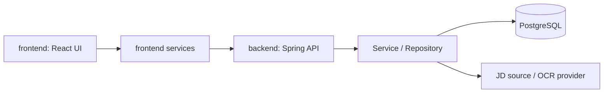

# JDSnack Architecture Map

상세 설계의 시작점입니다. 변경 전 영향 범위를 확인하고, 해당 영역의 상세 문서와 활성 spec 계약을 함께 봅니다.

## Dependencies

- UI와 API 계약: [Frontend architecture](architecture/frontend-architecture.md), 활성 spec의 `api-spec.md`
- 백엔드 내부 경계: [Backend architecture](architecture/backend-architecture.md)
- 외부 JD·OCR 연동: [Integration architecture](architecture/integration-architecture.md)
- 전체 런타임과 변경 영향: [System overview](architecture/system-overview.md)

## Change guide

- API 응답이나 입력 모델을 바꾸면 프론트 service, backend controller/service, `api-spec.md`, 관련 테스트를 함께 갱신합니다.
- 외부 JD 수집/OCR을 바꾸면 integration 문서, fallback 테스트, SSRF·크기 제한 정책을 함께 확인합니다.
- 저장 모델을 바꾸면 backend architecture, migration, repository/service 테스트를 함께 갱신합니다.
