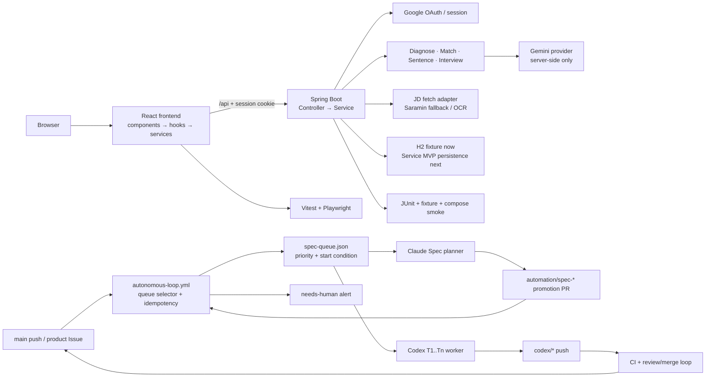

# 시스템 개요

## 핵심 요약

JDSnack은 Spring Boot API와 React 프론트를 **분리 컨테이너로 배포하는 아키텍처**를 채택합니다.
목표는 역할 분리, 독립 배포, 운영 확장성을 확보하는 것입니다.

## 시스템 구성

- 사용자 브라우저에서 React SPA 실행
- React가 `/api/diagnose`와 `/api/health` 호출
- 프론트 컨테이너가 SPA를 제공
- 백엔드 컨테이너가 REST API를 제공
- Spring Boot가 인증·입력 검증·분석 orchestration·JD 수집을 담당
- Gemini·사람인 수집은 백엔드 provider/adapter 경계에서만 호출
- 현재 preview 흐름은 fixture/stub/ai-local 모드로 검증하며 Service MVP는 사용자 소유 분석 이력을 추가한다

## Dependency & data flow

### Change impact guide

| 변경 지점 | 함께 확인할 대상 |
|---|---|
| `frontend/src/services/*` | hook, `App.test.tsx`, UI spec, backend controller contract |
| `backend/.../Controller` | Service, request/response DTO, API spec, controller test |
| `backend/.../Service` | provider/adapter, fixture test, error contract |
| 인증·세션 | `AuthGate`, authentication filter, 보호 API 401 test, smoke test |
| compose·runtime | container workflow, health endpoint, `scripts/smoke-test.sh` |

## 문서 역할

- 상세 백엔드 구조: [backend-architecture.md](backend-architecture.md)
- 상세 프론트 구조: [frontend-architecture.md](frontend-architecture.md)
- 통합/배포 구조: [integration-architecture.md](integration-architecture.md)
- 현재 구현 계약: [`../../.agent-os/standards/index.yml`](../../.agent-os/standards/index.yml)의 active spec과 이 문서를 함께 확인

## 핵심 불변 조건

- 프론트와 백은 서로 다른 컨테이너로 동작합니다.
- 외부 공개 엔드포인트는 reverse proxy 또는 ingress 뒤에서 하나의 서비스처럼 노출할 수 있습니다.
- Gemini 기반 진단·매칭과 사람인 OCR 폴백은 백엔드 경계에서만 수행합니다. 프론트는 API 계약과 비밀값 비노출 규칙을 지킵니다.
- 프론트는 API 계약에만 의존하고 외부 AI 세부 구현은 모릅니다.
- Service MVP에서 사용자·이력서·분석 결과 영속 저장을 도입하기 전까지의 fixture·로컬 저장 흐름은 제품 검증 이력으로 취급합니다.
- Spec 자동화는 `spec-queue.json`을 유일한 실행 큐로 사용합니다. `main push`와 승인된 제품 Issue가 큐 선택·Spec 승격·Codex 디스패치를 깨우며, 5분 폴링은 정상 트리거가 아닙니다.
