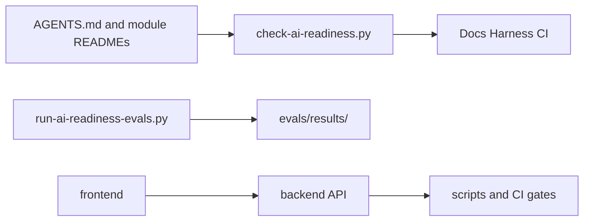

# 자동화 스크립트

## Purpose

로컬 smoke test, PR 피드백, AI 준비도 문서 검증을 한곳에서 실행합니다.

## Key files

- `check-ai-readiness.py`: 모듈 안내 문서, Markdown 링크, 정적 eval 케이스를 검사합니다.
- `run-ai-readiness-evals.py`: Codex CLI를 읽기 전용으로 실행해 context-on/off 계획 결과와 지표를 기록합니다.
- `install-git-hooks.sh`: 버전관리되는 `.githooks/`를 현재 clone의 Git hook 경로로 연결합니다.
- `smoke-test.sh`: 실행 중인 서비스의 기본 API smoke test를 수행합니다.
- `pr-review-gate.sh`: PR 리뷰 게이트 결과를 확인합니다.
- `autonomous_spec_loop.py`: Spec 완료·승격·티켓 디스패치 결정을 결정론적으로 계산합니다.
- `autonomous-spec-loop.sh`: GitHub 이벤트를 Spec 큐와 Claude/Codex 실행기로 연결합니다.

## Patterns

- 새 문서 검사는 표준 라이브러리만 사용하고 CI에서 재현 가능해야 합니다.
- 스크립트 추가·변경 시 [AI 준비도 정책](../.agent-os/ai-readiness.yml)과 [문서 인덱스](../.agent-os/standards/index.yml)를 함께 갱신합니다.

## Cross-module dependencies



## Gotchas

- `check-ai-readiness.py`의 제외 경로는 의존성·빌드 산출물·archive이며, 실제 문서 링크는 모두 검사합니다.
- [대표 eval](../evals/context-tasks.json)은 읽기 전용 계획 평가입니다. 구현 정확도·재작업률은 별도 PR/이슈 telemetry 없이는 측정하지 않습니다.
- 성공한 eval 전체 실행은 `evals/results/latest.json`으로 게시되며, 정책의 `eval_pass_rate_threshold` 미달 시 readiness gate가 실패합니다.
- API key는 사용하지 않습니다. 형님 로컬 Codex 로그인 세션에서 실행하며, 결과 JSON은 `evals/results/`에만 저장됩니다.

## Dependencies

- CI는 [Docs Harness workflow](../.github/workflows/docs-harness.yml)에서 readiness gate를 실행합니다.
- 모델 eval은 의도적으로 CI에서 실행하지 않습니다. API 비용 대신 필요할 때만 로컬 Codex 사용 한도를 소모합니다.
- 서비스 변경은 [아키텍처 지도](../docs/ARCHITECTURE.md)와 활성 spec의 수용 기준을 함께 확인합니다.
- 5분 폴링을 기본 트리거로 사용하지 않습니다. `.github/workflows/autonomous-loop.yml`이 main 반영과 승인된 제품 Issue를 감지합니다.

## Commands

```bash
python3 scripts/check-ai-readiness.py
sh scripts/install-git-hooks.sh
python3 scripts/run-ai-readiness-evals.py --dry-run
bash scripts/smoke-test.sh
```
